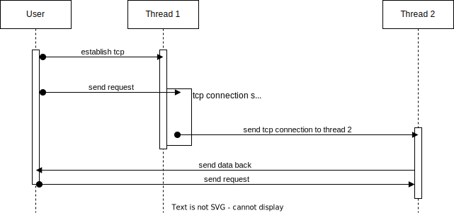

# sharded-thread

"*Application tail latency is critical for services to meet their latency 
expectations. We have shown that the thread-per-core approach can reduce 
application tail latency of a key-value store by up to 71% compared to baseline 
Memcached running on commodity hardware and Linux.*"[^1]

[^1]: [The Impact of Thread-Per-Core Architecture on Application Tail Latency](https://helda.helsinki.fi/server/api/core/bitstreams/3142abaa-16e3-4ad0-beee-e62add589fc4/content)

## Introduction

This library is mainly made for `io-uring` and monoio. There are no dependency
on the runtime, so you should be able to use it with other runtime and also
without `io-uring`.

The purpose of this library is to have a performant way to send data between
thread when threads are following a `thread per core` architecture.

Thanks to [Glommio](https://github.com/DataDog/glommio/) for the inspiration.

## Example

Originally, the library was made when you had multiple thread listening to the
same `TcpStream` and depending on what is sent through the `TcpStream` you might
want to change the thread handling the stream.

    

It allows you to avoid sharing data between thread, and so avoid a lot of issues
like false sharing[^2].

[^2]: An excellent article explaining it: [alic.dev](https://alic.dev/blog/false-sharing).

You can check some examples in the tests.

## References

- [Glommio example on their sharding](https://github.com/DataDog/glommio/blob/master/examples/sharding.rs)
- [The original monoio issue](https://github.com/bytedance/monoio/issues/213)
- [Sharded Queue - the fastest concurrent collection](https://github.com/ivanivanyuk1993/utility.sharded_queue)

## License

Licensed under either of

- Apache License, Version 2.0, (LICENSE-APACHE or http://www.apache.org/licenses/LICENSE-2.0)
- MIT license (LICENSE-MIT or http://opensource.org/licenses/MIT) at your option.
